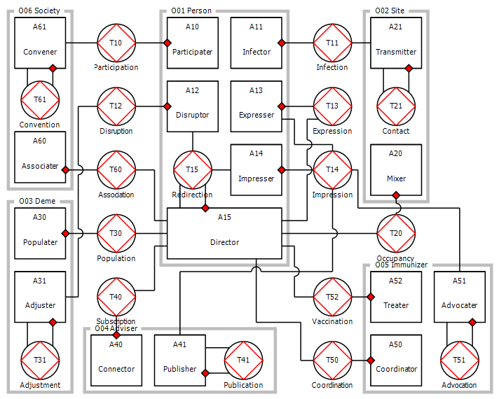

# smetweb-epidemes

This library contains an adapted version of the [epidemes v0.2.0 modeling and mic<b>R0</b>simulation framework](https://github.com/krevelen/epidemes/releases/tag/v0.2.0) delivered in 2017 for ZonMW research project 522002008: [**From individual perception of vaccination risks and benefits to compliance, costs and effects of vaccination programmes: a pilot study for influenza, HPV and measles**](https://www.zonmw.nl/nl/onderzoek-resultaten/gezondheidsbescherming/programmas/project-detail/infectieziektebestrijding-2014-2017/from-individual-perception-of-vaccination-risks-and-benefits-to-compliance-costs-and-effects-of-vac/verslagen/), as part of ZonMW's programme [*Infectieziektebestrijding 2014-2017*](https://www.zonmw.nl/nl/onderzoek-resultaten/gezondheidsbescherming/programmas/programma-detail/infectieziektebestrijding-2014-2017/).

The delivered **epidemes** framework was co-funded by [Smet WEB research project](https://www.rivm.nl/rivm/kennis-en-kunde/strategisch-programma-rivm/spr-2015-2018/wiskundige-modellering-ziekten/smet-web) as part of RIVM's [Strategic Programme (SPR) for 2015-2018](https://www.rivm.nl/rivm/kennis-en-kunde/strategisch-programma-rivm/spr-2015-2018)), such that it would support related projects. For instance, a [sample synthetic population with vaccination hesitancy](https://github.com/JHoogink/morphine) was developed for the [MORPHINE project](https://www.rivm.nl/rivm/kennis-en-kunde/strategisch-programma-rivm/spr-2015-2018/wiskundige-modellering-ziekten/morphine) within the same research programme.

This Smet WEB-adaptation includes: 
* replacing the build system (Maven &rarr; Gradle/Kotlin DSL);
* porting the programming language (Java 8 &rarr; Kotlin 1.3/Java 11); 
* standardizing the dependency injection mechanism ([Coala/Guice](https://github.com/krevelen/coala-binder) &rarr; Spring-Boot);
* etc.

## Alternatives

[Chao:2010:pcbi]: https://doi.org/10.1186/1471-2458-13-940
[Grefenstette:2013:bmcph]: https://doi.org/10.1186/1471-2458-13-940
[Kumar:2015:pmcph]: https://doi.org/10.1186/s12889-015-2284-2
[Willem:2015:bmcbi]: https://doi.org/10.1186/s12859-015-0612-2
[Eubank:2004:nature]: https://doi.org/10.1038/nature02541
[Stroud:2007:jasss]: http://jasss.soc.surrey.ac.uk/10/4/9.html
[Halloran:2008:pnas]: https://doi.org/10.1073/pnas.0706849105
[Rakowski:2010:jasss]: https://doi.org/10.18564/jasss.1529
[Epstein:2009:nature]: https://doi.org/10.1038/460687a
[Parker:2011:tomacs]: https://doi.org/10.1145/2043635.2043637
[Valle:2013:ch]: https://doi.org/10.1007/978-1-4614-5474-8_4
[Bryan:2015:vast]: https://doi.org/10.1109/VAST.2015.7347626
[Broeck:2011:bmcid]: https://doi.org/10.1186/1471-2334-11-37
[Eichner:2014:bmcid]: https://doi.org/10.1186/1471-2334-14-365
[Hennessy:2015:phm]: https://doi.org/10.1186/s12963-015-0057-x
[Bisset:2014:tomacs]: https://doi.org/10.1145/2501602
[Bisset:2009:ics]: https://doi.org/10.1145/1542275.1542336
[Barrett:2008:eea]: https://doi.org/10.1145/1413370.1413408
[Kuhlman:2011:wsc]: https://doi.org/10.1109/WSC.2011.6147758
[Zhang:2016:jasss]: https://doi.org/10.18564/jasss.3148
[Zhang:2016:phd]: https://doi.org/10.4233/uuid:8d0f67a3-d8e6-43ee-acc5-1633c617e023

### Open Source 

#### COVID-sim
The [COVIDsim](https://github.com/lvanhee/COVID-sim) NetLogo scenarios developed by [ASSOCC](https://simassocc.org/) were recently launched and continuously updated to model behavioral aspects of the COVID-19 pandemic and related social distancing policy changes.

#### FluTE
The [*FluTE* open-source simulator](https://github.com/dlchao/FluTE) developed by [Chao et al. (2010)][Chao:2010:pcbi] is actively maintained and incorporates daily routines and vaccination interventions for various household compositions congruent with [US census data of 2010](http://www2.census.gov/census_2000/datasets/PUMS/OnePercent/). *FluTE* seems optimized for certain susceptible-exposed-infectious-recovered (SEIR) compartmental models involving respiratory virus transmission and associated treatment procedures.

#### FRED
The [*FRED* open-source simulator](https://github.com/PublicHealthDynamicsLab/FRED) by [Grefenstette][Grefenstette:2013:bmcph] generates synthetic aging populations informed by regional census data at various levels, from national (mortality rates) and state (birth rates) levels down to household (residence) geographical coordinates. *FRED* has various available extensions, including [measles scenarios](http://fred.publichealth.pitt.edu/measles/), the [HERMES supply chain analysis tool](http://hermes.psc.edu/), and the [GAIA visualizer](http://gaia.psc.edu/). *FRED* has been used in a number of studies, including [Kumar et al. (2015)][Kumar:2015:pmcph]. 

#### Indismo
[*Indismo*](https://bitbucket.org/indismo/indismo) by [Willem et al. (2015)][Willem:2015:bmcbi] was used in comparison with the discrete-time *FluTE* and *FRED* simulators for two US-situated influenza scenarios, which resulted in several ways to improve upon their computational performance. 

### Closed Source
Developed at the Los Alamos National Laboratory, *EpiSims* by [Eubank et al. (2004)][Eubank:2004:nature] is an early synthetic population used for smallpox studies, which was later extended for influenza scenarios, e.g., [Stroud et al. (2007)][Stroud:2007:jasss], [Halloran et al. (2008)][Halloran:2008:pnas] [Valle et al. (2013)][Valle:2013:ch] and [Bryan et al. (2015)][Bryan:2015:vast].

Comparable synthetic populations include a virtual society of Poland by [Rakowski et al. (2010)][Rakowski:2010:jasss], the *Global-Scale Agent Model (GSAM)* by [Epstein et al. (2009)][Epstein:2009:nature] and [Parker et al. (2011)][Parker:2011:tomacs], [*GLEaMviz*](http://www.gleamviz.org/simulator/) by [Broeck et al. (2011)][Broeck:2011:bmcid], [*4Flu*](https://www.4flu.net/) by [Eichner et al. (2014)][Eichner:2014:bmcid], and *POHEM* by [Hennessy et al. (2015)][Hennessy:2015:phm]. 

*Indemics* by [Bisset et al. (2014)][Bisset:2014:tomacs] is another high-performance synthetic population that incorporates the *EpiFast* algorithm developed by [Bisset et al. (2009)][Bisset:2009:ics], an improvement of the *EpiSimdemics* algorithm by [Barrett et al. (2008)][Barrett:2008:eea]. *Indemics* has also been applied to various contagion scenarios besides disease, for instance social or financial behaviors. *InterSim* by [Kuhlman et al. (2011)][Kuhlman:2011:wsc] aimed to build upon *Indemics* as a graph-based generalized extension. 

*Artificial City*, an influenza scenario by [Zhang et al. (2016)][Zhang:2016:jasss], models the Beijing population of 19.6 million persons and has several novel features, including weekly mobility patterns in continuous time based on individual social behaviors and a complete public transportation component. Simulated individuals can follow over one hundred different social behavior scripts that were informed by highly detailed census data on citizen movement and behaviors. Several of its algorithms described by [Zhang (2016)][Zhang:2016:phd], including for instance its mobility dynamics, were adapted and implemented for **epidemes**.

## Synthethic Population

### Data sources
[Google Sheet](https://docs.google.com/spreadsheets/d/1S71E2j9bX46Rj6UssbKZo9UQR3O1jZrluWy3uCzz0NE/edit#gid=638032539)

### Visualization
e.g. https://www.codefor.nl/coronamap-nl/ (source [here](https://github.com/codefornl/coronamap-nl))

### Modules
As noted in this [(draft) report of ZonMW project 522002008](https://github.com/krevelen/epidemes/releases/download/v0.2.0/zonmw-522002008-report-draft.pdf), the epidemes ecosystem consists of several separate "modules" (actor kinds and transaction kinds, as per the [DEMO methodology](https://en.wikipedia.org/wiki/Design_%26_Engineering_Methodology_for_Organizations) common in [enterprise engineering](http://www.ee-institute.org/en)) to facilitate customization of your synthetic population.

#### Person
Representing a citizen of the synthetic population, each `Person` (O01) is a composite actor organised into various actor roles that describe his/her responsibility for executing several results, including:

|Actor| Executor Role  | Tx  | Result Kind     | Description |
| --- | -------------- | --- | --------------- | ----------- |
| A10 | `Participater` | T10 | `Participation` | R10 Person participates in some gathering
| A11 | `Infector`     | T11 | `Infection`     | R11 Person is infected by some pathogen
| A12 | `Disruptor`    | T12 | `Disruption`    | R12 Person migrates, un/couples, expands, etc.
| A13 | `Expresser`    | T13 | `Expression`    | R13 Person expresses their current opinion
| A14 | `Impresser`    | T14 | `Impression`    | R14 Person is impressed by another opinion
| A15 | `Director`     | T15 | `Redirection`   | R15 Person adjusts their current routine

Here the `Director` role (A15) can _self-initiate_ its own `Redirection` results, thus rendering the `Person` a **proactive** agent (as per terminology from [agent-based or individual-based modeling](https://en.wikipedia.org/wiki/Agent-based_model) and [collective intelligence](https://www.cs.vu.nl/~schut/pubs/Schut/2010.pdf) research fields). 

This organisation describes how various events or coordination facts between actors can occur.
For instance, upon invitation (T10/rq) for some `Gathering`, the `Participater` role of the `Person` actor decides whether to evade (T10/dc) or to attend (T10/st), and thereby affect the `Occupancy` of its venue (`Site`).
                                                    
#### Site

:

#### Deme

:

#### Adviser

:

#### Immunizer

:

#### Society

:
